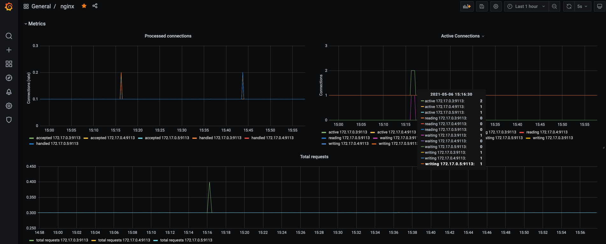

# n-volkov_platform
n-volkov Platform repository


## Знакомство с Kubernetes, основные понятия и архитектура

* Установлен и запущен Minikube.
* Настроено рабочее окружение.

При проведение тестов на устойчивость, на команду:

```
$ kubectl get componentstatuses
```

получил такой ответ:

```
Warning: v1 ComponentStatus is deprecated in v1.19+
NAME                 STATUS      MESSAGE
controller-manager   Unhealthy   Get "http://127.0.0.1:10252/healthz": dial tcp 127.0.0.1:10252: connect: connection r
scheduler            Unhealthy   Get "http://127.0.0.1:10251/healthz": dial tcp 127.0.0.1:10251: connect: connection r
etcd-0               Healthy     {"health":"true"}
```

Поправил:

```
$ minikube ssh
$ sudo vi /etc/kubernetes/manifests/kube-controller-manager.yaml
```

удалена строка конфигурации: `- --port=0`

```
sudo vi /etc/kubernetes/manifests/kube-scheduler.yaml
```

удалена строка конфигурации: `- --port=0`

```
$ sudo systemctl restart kubelet.service
```

После проделанных действий получил:

```
$ kubectl get componentstatuses
Warning: v1 ComponentStatus is deprecated in v1.19+
NAME                 STATUS    MESSAGE             ERROR
controller-manager   Healthy   ok
scheduler            Healthy   ok
etcd-0               Healthy   {"health":"true"}
```

### Задание

* Разберитесь почему все pod в namespace kube-system восстановились после удаления.

#### Ответ

Pod coredns принадлежит (ownerReferences) контроллеру ReplicaSet.

```
$ kubectl get rs -n kube-system
NAME                DESIRED   CURRENT   READY   AGE
coredns-74ff55c5b   1         1         1       177m
```

Который в свою очередь принадлежит контроллеру Deployment. Данный контроллер ReplicaSet имеет, среди прочих, параметр:

```
spec:
  replicas: 1
```

Т.е. всегда должен быть активен один экземпляр pod-а coredns.

Pod kube-proxy принадлежит (ownerReferences) контроллеру DaemonSet. Который гарантирует, что на каждом узле кластера будет активен экземпляр управляемого им pod-а.

Остальные pod-ы: etcd-minikube, kube-apiserver-minikube, kube-controller-manager-minikube и kube-scheduler-minikube, принадлежат узлу (node), и управляются непосредственно kubelet. Kubelet следит за ними, и активирует вновь при падении.

* Был создан Dockerfile, который:
 * запускает web-сервер на порту 8000;
 * отдает содержимое директории /app внутри контейнера;
 * работающий с UID 1001;
* Dockerfile был помещен в созданную директорию `kubernetes-intro/web`;
* Из Dockerfile был собран образ контейнера и помещен в публичный Container Registry - Docker Hub;
* Был написан манифест web-pod.yaml для создания pod **web**, с использованием  ранее собранного образа с Docker Hub. Манифест был помещен в директорию `kubernetes-intro/`;
* Были опробованы следующие команды:
 * `$ kubectl apply -f web-pod.yaml`
 * `$ kubectl get pod web -o yaml`
 * `$ kubectl describe pod web`
* В манифест web-pod.yaml было добавлено описание init контейнера, генерирующего страницу index.html;
 * *image* init контейнера содержит wget;
 * *command* init контейнера: `['sh', '-c', 'wget -O- https://tinyurl.com/otus-k8s-intro | sh'];`
* Для того, чтобы файлы, созданные в init контейнере, были доступны основному контейнеру, в манифест было добавлено описание volume типа *emptyDir*;
* Обновленный pod **web** был запущен, после удаления старого pod:
 * следил за процессом запуска:  
`$ kubectl get pods -w`;
 * проверил работоспособность web сервера:  
`$ kubectl port-forward --address 0.0.0.0 pod/web 8000:8000`  
`$ curl 'http://localhost:8000/index.html'`

* Знакомство с микросервисным приложением Hipster Shop;
* Запуск внутри кластера одного его компонента - микросервиса frontend;
 * был сделан клон репозитория `https://github.com/GoogleCloudPlatform/microservices-demo`;
 * собран образ контейнера для frontend из `microservices-demo/src/frontend/Dockerfile`;
 * собранный образ был помещен на Docker Hub;
 * используя ad-hoc режим, был сгенерирован манифест средствами kubectl:  
`$ kubectl run frontend --image blackwolf292/kubernetes-intro-frontend:v1 --restart=Never --dry-run=client -o yaml > frontend-pod.yaml`


### Задание

* Выясните причину, по которой pod frontend находится в статусе Error.
* Создайте новый манифест frontend-pod-healthy.yaml. При его применении ошибка должна исчезнуть.

#### Ответ

Попытка запуска pod frontend, завершилась ошибкой. Найденная причина - отсутствие описания environment variable в конфигурации контейнера:

```
$ kubectl apply -f frontend-pod.yaml
$ kubectl get pods -w
NAME       READY   STATUS              RESTARTS   AGE
frontend   0/1     ContainerCreating   0          18s
frontend   0/1     Error               0          20s

$ kubectl logs frontend
.....
panic: environment variable "CHECKOUT_SERVICE_ADDR" not set
.....
```

Для устранения ошибки в манифест, в секцию spec, было добавлено:

```
    env:
    - name: PRODUCT_CATALOG_SERVICE_ADDR
      value: "productcatalogservice:3550"
    - name: CURRENCY_SERVICE_ADDR
      value: "currencyservice:7000"
    - name: CART_SERVICE_ADDR
      value: "cartservice:7070"
    - name: RECOMMENDATION_SERVICE_ADDR
      value: "recommendationservice:8080"
    - name: CHECKOUT_SERVICE_ADDR
      value: "checkoutservice:5050"
    - name: SHIPPING_SERVICE_ADDR
      value: "shippingservice:50051"
    - name: AD_SERVICE_ADDR
      value: "adservice:9555"
```

Новый манифест был сохранен как frontend-pod-healthy.yaml. Проверен:

```
$ kubectl apply -f frontend-pod-healthy.yaml
$ kubectl get pods -n default
NAME       READY   STATUS    RESTARTS   AGE
frontend   1/1     Running   0          27s
```

И помещен в директорию kubernetes-intro.

## Механика запуска и взаимодействия контейнеров в Kubernetes

* Используя frontend-replicaset.yaml, попытались создать объект ReplicaSet. Получили ошибку.

### Задание

Изменить frontend-replicaset.yaml так, что бы устранить ошибку. И применить его.

#### Ответ

```
error: error validating "frontend-replicaset.yaml":  
error validating data: ValidationError(ReplicaSet.spec): missing required field "selector"  
in io.k8s.api.apps.v1.ReplicaSetSpec
```

Добавил в манифест поле selector

```
  selector:
    matchLabels:
      app: frontend
```

* Изменили манифест frontend-replicaset.yaml так, что из него сразу разворачивается 3 реплики сервиса.

* Изменили версию образа в манифесте frontend-replicaset.yaml. Применили манифест.

### Вопрос

Почему обновление ReplicaSet (изменена версия образа контейнера) не повлекло обновление запущенных pod.

#### Ответ

ReplicaSet следит только за тем, что запущено указанное количество pod-ов. Т.к. указанное количество pod-ов уже было запущено, никаких других изменений не произошло.

* Сделал образы для микросервиса paymentService, и залил на Docker Hub. Сделал манифест paymentservice-replicaset.yaml для развертывания трех реплик из образа v1.
* Подготовил и применил Deployment манифест paymentservice-deployment.yaml. В результате чего появилось 3 реплики сервиса payment в состоянии Ready.
* Убедился, на смени версии образа в манифесте Deployment, что работает, как обновление pod, так и откат на предыдущую версию. Увидел, что при обновлении использовалась стратегия по умолчанию - Rolling Update, и наличие двух ReplicaSet.
* Подготовил манифест frontend-deployment.yaml с описанием readinessProbe. Из которого успешно развернул 3 экземпляра pod frontend.
* Изменил URL проверки readinessProbe на `/_health`. Получил ошибку при применении манифеста:  
`Readiness probe failed: HTTP probe failed with statuscode: 404`  
А при использовании команды: `kubectl rollout status deployment frontend-deployment --timeout=60s`, получил:  
`Waiting for deployment "frontend-deployment" rollout to finish: 1 out of 3 new replicas have been updated...`  `error: timed out waiting for the condition`

* Подготовлен манифест node-exporter-daemonset.yaml.

### Задание

Изменить node-exporter-daemonset.yaml так, что бы Node Exporter был развернут не только на worker узлах, но и на master.

#### Ответ

Надо либо отключить политику `Taints: node-role.kubernetes.io/master:NoSchedule` для master узлов, либо дать разрешение pod-ам Node Exporter разворачиваться на master узлах. Например так:

```
tolerations:
  operator: "Exists"
```

## Что стоит знать о безопасности и управлении доступом в Kubernetes

* Рассмотрена авторизация в Кubernetes на основе RBAC.
* Созданы манифесты для создания объектов в Кubernetes.
* Созданы манифесты для управления доступом к Namespaces и к кластеру в целом.

### Task01

1. Создать Service Account **bob**, дать ему роль `admin` в рамках всего кластера;
2. Создать Service Account **dave** без доступа к кластеру;

В ходе выполнения задания были подготовлены и применены манифесты: `01-sa-bob.yaml`, `02-bob-clusteradmin-rolebinding.yaml`, `03-sa-dave.yaml`.

```
# kubectl get sa -n default
NAME            SECRETS   AGE
bob             1         3m32s
dave            1         52s
default         1         3d2h
ingress-nginx   1         44h
```

```
# kubectl get clusterrolebindings bob-rolebinding
NAME              ROLE                        AGE
bob-rolebinding   ClusterRole/cluster-admin   13m
```

### Task02

1. Создать Namespace `prometheus`.
2. Создать Service Account **carol** в этом Namespace.
3. Дать всем Service Account в Namespace `prometheus` возможность делать *get*, *list*, *watch* в отношении Pods всего кластера.

В ходе выполнения задания были подготовлены и применены манифесты: `01-ns-prometheus.yaml`, `02-sa-carol.yaml`, `03-pod-info-role.yaml`, `04-pod-info-rolebinding.yaml`.

```
# kubectl get ns prometheus
NAME         STATUS   AGE
prometheus   Active   3h27m
```

```
# kubectl get sa -n prometheus
NAME      SECRETS   AGE
carol     1         3h30m
default   1         3h33m
```

```
# kubectl get clusterrole pod-info
NAME       CREATED AT
pod-info   2021-04-13T12:02:30Z
```

```
# kubectl get clusterrolebindings -n prometheus pod-info-rolebinding
NAME                   ROLE                   AGE
pod-info-rolebinding   ClusterRole/pod-info   172m
```

### Task03

1. Создать Namespace `dev`
2. Создать Service Account **jane** в Namespace `dev`
3. Дать **jane** роль *admin* в рамках Namespace `dev`
4. Создать Service Account **ken** в Namespace `dev`
5. Дать **ken** роль *view* в рамках Namespace `dev`


В ходе выполнения задания были подготовлены и применены манифесты: `01-ns-dev.yaml`, `02-sa-jane.yaml`, `03-jane-admin-rolebinding.yaml`, `04-sa-ken.yaml`, `05-ken-view-rolebinding.yaml`.

```
# kubectl get ns dev
NAME   STATUS   AGE
dev    Active   3s
```

```
# kubectl get sa -n dev
NAME      SECRETS   AGE
default   1         119s
jane      1         81s
ken       1         4s
```

```
# kubectl get rolebindings -n dev
NAME                     ROLE                AGE
jane-admin-rolebinding   ClusterRole/admin   21s
ken-view-rolebinding     ClusterRole/view    6s
```

## Volumes, Storages, Stateful приложения

* С помощью инструмента Kind, поднят одноузловый кластер K8S.
* Развернут StatefulSet с MinIO, и создан Headless Service. Для чего были созданы манифесты: `minio-statefulset.yaml`, `minio-headless-service.yaml`.

```
$ kubectl get statefulsets minio
NAME    READY   AGE
minio   1/1     24m
```

```
$ kubectl get pods minio-0
NAME      READY   STATUS    RESTARTS   AGE
minio-0   1/1     Running   0          23m
```

```
$ kubectl get service minio
NAME    TYPE        CLUSTER-IP   EXTERNAL-IP   PORT(S)    AGE
minio   ClusterIP   None         <none>        9000/TCP   4h20m
```

```
$ kubectl get pvc
NAME           STATUS   VOLUME                                     CAPACITY   ACCESS MODES   STORAGECLASS   AGE
data-minio-0   Bound    pvc-da9cc2ed-5206-4b98-be93-42a02bd4dc8f   10Gi       RWO            standard       24m
```

```
$ kubectl get pv
NAME                                       CAPACITY   ACCESS MODES   RECLAIM POLICY   STATUS   CLAIM                  STORAGECLASS   REASON   AGE
pvc-da9cc2ed-5206-4b98-be93-42a02bd4dc8f   10Gi       RWO            Delete           Bound    default/data-minio-0   standard                24m
```

* Затем, для повышения безопасности, изменил манифест `minio-statefulset.yaml` на использование *secrets*. Для чего был создан манифест `minio-secret.yaml`.

```
$ kubectl get secrets minio-secret
NAME           TYPE     DATA   AGE
minio-secret   Opaque   2      24m
```

## Сетевое взаимодействие Pod, сервисы

### Работа с тестовым веб-приложением

Выполнено:

* Добавление проверок Pod
* Создание объекта Deployment
* Добавление сервисов в кластер ( ClusterIP )
* Включение режима балансировки IPVS

В результат были написаны манифесты: `web-deploy.yaml`, `web-svc-cip.yaml`.

### Доступ к приложению извне кластера

Выполнено:

* Установка MetalLB в Layer2-режиме
* Добавление сервиса LoadBalancer
* Установка Ingress-контроллера и прокси ingress-nginx
* Создание правил Ingress

В результат были написаны манифесты: `metallb-config.yaml`, `web-svc-lb.yaml`, `nginx-lb.yaml`, `web-svc-headless.yaml`, `web-ingress.yaml`.

#### Доступ к CoreDNS снаружи кластера

В результат были написаны манифесты: `coredns/coredns-svc-lb-tcp.yaml`, `coredns/coredns-svc-lb-udp.yaml`.

## Шаблонизация манифестов Kubernetes

Добавление репозитория *stable* вызвало ошибку:

```
$ helm repo add stable https://kubernetes-charts.storage.googleapis.com  
Error: repo "https://kubernetes-charts.storage.googleapis.com" is no longer available;
try "https://charts.helm.sh/stable" instead
```

Было исправлено:

```
$ helm repo add stable https://charts.helm.sh/stable
```

### nginx-ingress

Создал namespace и release *nginx-ingress*

```
$ kubectl get ns nginx-ingress
NAME            STATUS   AGE
nginx-ingress   Active   39h
```

```
$ helm ls -n nginx-ingress
NAME         	NAMESPACE    	REVISION	UPDATED                             	STATUS  	CHART               	APP VERSION
nginx-ingress	nginx-ingress	1       	2021-05-03 00:38:42.924727 +0300 MSK	deployed	nginx-ingress-1.41.3	v0.34.1
```

```
$ kubectl get service -n nginx-ingress
NAME                            TYPE           CLUSTER-IP     EXTERNAL-IP    PORT(S)                      AGE
nginx-ingress-controller        LoadBalancer   10.36.12.142   34.89.241.29   80:30940/TCP,443:30776/TCP   39h
nginx-ingress-default-backend   ClusterIP      10.36.8.204    <none>         80/TCP                       39h
```

### cert-manager

Добавил репозиторий:

```
$ helm repo add jetstack https://charts.jetstack.io
```

Создал namespace cert-manager и установил *cert-manager*

```
$ kubectl get ns cert-manager
NAME           STATUS   AGE
cert-manager   Active   39h
```

```
$ kubectl get pods -n cert-manager
NAME                                       READY   STATUS    RESTARTS   AGE
cert-manager-7998c69865-sj2rh              1/1     Running   0          39h
cert-manager-cainjector-7b744d56fb-lnmmv   1/1     Running   0          39h
cert-manager-webhook-7d6d4c78bc-9lcpm      1/1     Running   0          39h
```

Создал два ClusterIssuer:

```
$ kubectl apply -f kubernetes-templating/cert-manager/letsencrypt-prod.yaml
$ kubectl apply -f kubernetes-templating/cert-manager/letsencrypt-stage.yaml
```

### chartmuseum

Создал namespace chartmuseum и установил релиз, используя кастомизированный `values.yaml`

```
$ helm ls -n chartmuseum
NAME       	NAMESPACE  	REVISION	UPDATED                             	STATUS  	CHART             	APP VERSION
chartmuseum	chartmuseum	1       	2021-05-04 16:22:54.441749 +0300 MSK	deployed	chartmuseum-2.13.2	0.12.0
```

```
$ kubectl get certificate -n chartmuseum
NAME              READY   SECRET            AGE
chartmuseum-tls   True    chartmuseum-tls   2m6s
```

```
$ curl -Iv 'https://chartmuseum.34.89.241.29.nip.io'
*   Trying 34.89.241.29...
* TCP_NODELAY set
* Connected to chartmuseum.34.89.241.29.nip.io (34.89.241.29) port 443 (#0)
* ALPN, offering h2
* ALPN, offering http/1.1
* successfully set certificate verify locations:
*   CAfile: /etc/ssl/cert.pem
  CApath: none
* TLSv1.2 (OUT), TLS handshake, Client hello (1):
* TLSv1.2 (IN), TLS handshake, Server hello (2):
* TLSv1.2 (IN), TLS handshake, Certificate (11):
* TLSv1.2 (IN), TLS handshake, Server key exchange (12):
* TLSv1.2 (IN), TLS handshake, Server finished (14):
* TLSv1.2 (OUT), TLS handshake, Client key exchange (16):
* TLSv1.2 (OUT), TLS change cipher, Change cipher spec (1):
* TLSv1.2 (OUT), TLS handshake, Finished (20):
* TLSv1.2 (IN), TLS change cipher, Change cipher spec (1):
* TLSv1.2 (IN), TLS handshake, Finished (20):
* SSL connection using TLSv1.2 / ECDHE-RSA-AES128-GCM-SHA256
* ALPN, server accepted to use h2
* Server certificate:
*  subject: CN=chartmuseum.34.89.241.29.nip.io
*  start date: May  4 12:23:23 2021 GMT
*  expire date: Aug  2 12:23:23 2021 GMT
*  subjectAltName: host "chartmuseum.34.89.241.29.nip.io" matched cert's "chartmuseum.34.89.241.29.nip.io"
*  issuer: C=US; O=Let's Encrypt; CN=R3
*  SSL certificate verify ok.
* Using HTTP2, server supports multi-use
* Connection state changed (HTTP/2 confirmed)
* Copying HTTP/2 data in stream buffer to connection buffer after upgrade: len=0
* Using Stream ID: 1 (easy handle 0x7fd9d700e800)
> HEAD / HTTP/2
> Host: chartmuseum.34.89.241.29.nip.io
> User-Agent: curl/7.64.1
> Accept: */*
```

### harbor

Создал namespace harbor и установил релиз, используя кастомизированный `values.yaml`

```
$ helm ls -n harbor
NAME  	NAMESPACE	REVISION	UPDATED                             	STATUS  	CHART       	APP VERSION
harbor	harbor   	1       	2021-05-03 02:15:01.383419 +0300 MSK	deployed	harbor-1.5.5	2.1.5
```

```
$ kubectl get pods -n harbor
NAME                                         READY   STATUS    RESTARTS   AGE
harbor-harbor-chartmuseum-79f856d678-k79rf   1/1     Running   0          39h
harbor-harbor-clair-67946fcbd8-l7vtf         2/2     Running   140        39h
harbor-harbor-core-5f4585fc46-pgtzr          1/1     Running   0          39h
harbor-harbor-database-0                     1/1     Running   0          39h
harbor-harbor-jobservice-8564dff769-zwph7    1/1     Running   0          39h
harbor-harbor-portal-77bb869946-qqk78        1/1     Running   0          39h
harbor-harbor-redis-0                        1/1     Running   0          39h
harbor-harbor-registry-545df85c57-7t9gr      2/2     Running   0          39h
harbor-harbor-trivy-0                        1/1     Running   0          39h
```

```
$ kubectl get certificate -n harbor
NAME         READY   SECRET       AGE
harbor-tls   True    harbor-tls   39h
```

### Создаем свой helm chart

Были созданы, и загружены в harbor, два chart-а: **frontend** и **hipster-shop**

```
$ helm search repo hipster-shop
NAME                   	CHART VERSION	APP VERSION	DESCRIPTION
templating/hipster-shop	0.1.0        	1.16.0     	A Helm chart for Kubernetes
```

```
$ helm search repo frontend
NAME               	CHART VERSION	APP VERSION	DESCRIPTION
templating/frontend	0.1.0        	1.16.0     	A Helm chart for Kubernetes
```

### Kubecfg

Был создан, и проверен в работе, `services.jsonnet` – шаблон для сервисов *paymentservice* и *shippingservice*.

### Kustomize

Для сервиса *adservice*, разделенного на манифесты `adservice-deployment.yaml` и `adservice-service.yaml`, были написаны `kustomization.yaml` для установки в два окружения: **dev** (namespace hipster-shop) и **prod** (namespace hipster-shop-prod).

## Мониторинг сервиса в кластере k8s

Был создан кастомный образ *nginx*, и загружен в Docker Hub.  
Был развернут *kube-prometheus* (release-0.8):

```
$ kubectl create -f manifests/setup
$ kubectl create -f manifests/
```

Были написаны, и применены:

* `deployment.yaml` и `service.yaml` - для *nginx* и *nginx exporter*;
* `ingress.yaml` - для доступа к *Prometheus* и *Grafana*, и для тестовых запросов к *nginx*;

```
$ kubectl get service -n ingress-nginx
NAME                                                     TYPE           CLUSTER-IP      EXTERNAL-IP     PORT(S)                      AGE
ingress-nginx-nginx-ingress-controller                   LoadBalancer   10.98.70.194    172.16.18.200   80:31400/TCP,443:31335/TCP   16h
...
```

```
$ kubectl describe ingresses nginx-monitoring-ingress -n monitoring
...
Rules:
  Host                                   Path  Backends
  ----                                   ----  --------
  nginx-monitoring.172.16.18.200.nip.io
                                         /   nginx-monitoring-service:80 (172.17.0.3:8888,172.17.0.4:8888,172.17.0.5:8888)
  prometheus.172.16.18.200.nip.io
                                         /   prometheus-k8s:9090 (172.17.0.18:9090,172.17.0.19:9090)
  grafana.172.16.18.200.nip.io
                                         /   grafana:3000 (172.17.0.15:3000)
Annotations:                             kubernetes.io/ingress.class: nginx
...
```

* `servicemonitor.yaml` - для работы *Prometheus service discovery*, и мониторинга *nginx*.

```
$ kubectl describe servicemonitors nginx-monitoring -n monitoring
Name:         nginx-monitoring
Namespace:    monitoring
Labels:       app=nginx-monitoring
Annotations:  <none>
API Version:  monitoring.coreos.com/v1
Kind:         ServiceMonitor
...
Spec:
  Endpoints:
    Interval:  10s
    Port:      metrics
  Selector:
    Match Labels:
      App:  nginx-monitoring
...
```

### Результаты

```
$ curl 'http://nginx-monitoring.172.16.18.200.nip.io/basic_status'
Active connections: 2
server accepts handled requests
 921 921 2750
Reading: 0 Writing: 1 Waiting: 1
```

```
http://prometheus.172.16.18.200.nip.io/graph?g0.expr=nginx_connections_accepted&g0.tab=0&g0.stacked=0&g0.range_input=1h
```


```
http://grafana.172.16.18.200.nip.io/d/nginx/nginx?orgId=1&refresh=5s
```


